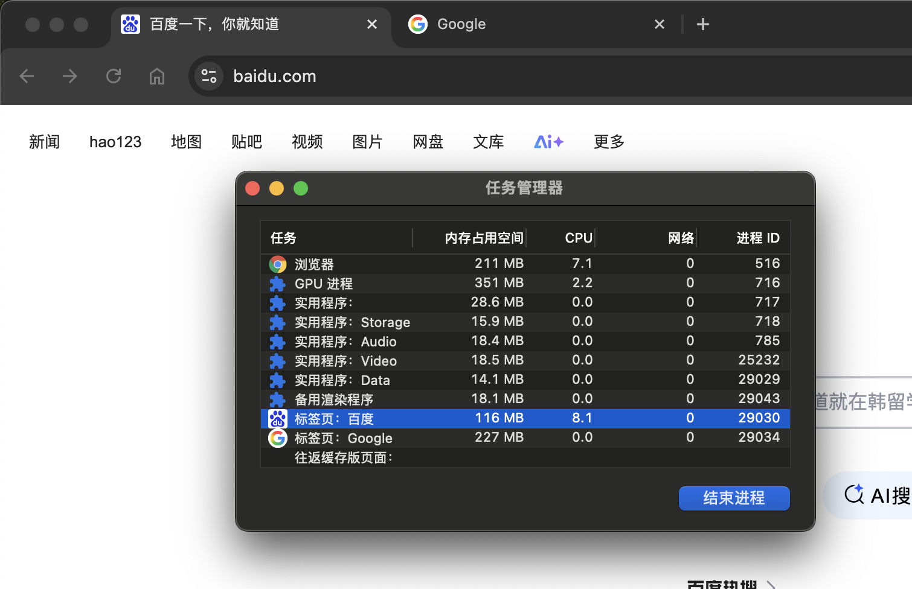
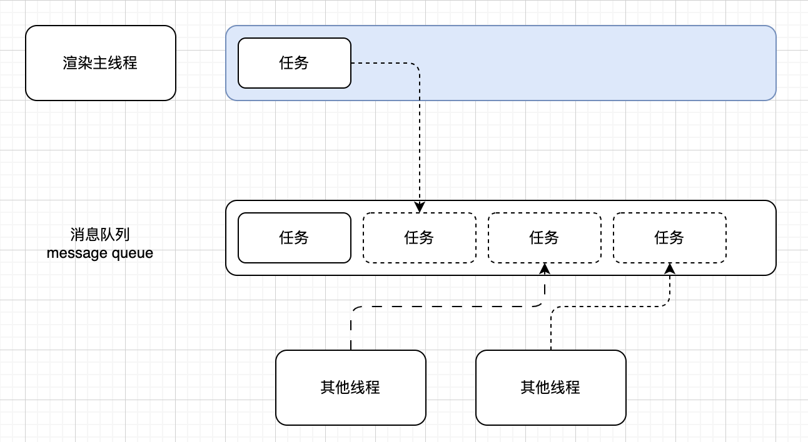

# 事件循环

## 进程模型

一个应用程序通常由多个进程组成，每个进程都有自己的内存空间和资源。进程之间通过 IPC（进程间通信）机制进行通信和数据交换。

一个进程可以包含多个线程，每个线程都有自己的执行栈和程序计数器，但共享进程的内存空间和资源。线程之间的通信通常通过共享内存或消息传递机制实现。

### 浏览器有哪些进程和线程

- 浏览器进程

主要负责界面显示、用户交互、子进程管理等。浏览器进程内部会启动多个子线程处理不同的任务。

- 网络进程

负责加载网络资源。网络进程内部会启动多个子线程来处理不同的网络请求。

- 渲染进程（事件循环发生的地方）

渲染进程启动后，会开启一个`渲染主线程`，渲染主线程负责解析执行 HTML、CSS、JavaScript 等资源，并将它们渲染到屏幕上。

> 目前默认一个渲染进程是一个浏览器标签页，保证每个标签页的独立性和安全性。Google Chrome 想改变这种模式，计划将多个标签页的渲染进程合并（类似同一个域名下的标签页使用同一个渲染进程），以提高性能和资源利用率。



### 渲染主线程如何工作

渲染主线程是浏览器中最繁忙的线程，需要它处理的任务包括但不限于：

- 解析 HTML、CSS 等资源
- 执行 JavaScript 代码
- 计算样式和布局
- 处理图层
- 绘制页面内容（每秒把页面画 60 次）
- 事件处理函数
- 计时器回调函数

> 思考：为什么渲染进程不适用多个线程来处理这些事情？

要处理这么多任务，渲染主线程该怎么调度任务？

- 正在执行一个JS函数，执行到一半时用户点击了按钮，该不该立即去执行点击事件？
- 正在执行一个JS函数，执行到一半时某个计时器到达了时间，该不该立即去执行计时器回调？

渲染主线程想了一个办法来处理这些问题：排队



1. 最开始时，渲染主线程会进入一个无限循环。
2. 每一次循环会检查消息队列中是否有任务存在。如果有，就取出第一个任务执行，执行完一个后进入下一次循环；如果没有，则进入休眠状态。
3. 其他线程（包括其他进程的线程）可以随时想消息队列中添加任务。新任务会添加到消息队列的末尾。在添加新任务时，如果主线程是休眠状态，则会将其唤醒以继续循环拿去任务。

整个过程被称之为事件循环（消息循环）

### 若干解释

#### 何为异步？

代码在执行过程中，会遇到一些无法立即处理的任务，比如:
- 计时完成后需要执行的任务`setTimeout`、`setInterval`
- `XMLHttpRequest`、`Fetch`网络通信完成后需要执行的任务
- `addEventListener`用户操作后需要执行的任务

如果让渲染主线程等待这些任务的时机达到，就会导致主线程长期处于「阻塞」的状态，从而导致浏览器「卡死」

渲染主线程承担着极其重要的工作，无论如何都不能阻塞!

因此，浏览器选择异步来解决这个问题

使用异步的方式，渲染主线程永不阻塞

> 面试题:如何理解 JS 的异步?

参考答案:

JS是一门单线程的语言，这是因为它运行在浏览器的渲染主线程中，而渲染主线程只有一个。

而渲染主线程承担着诸多的工作，渲染页面、执行 JS 都在其中运行。如果使用同步的方式，就极有可能导致主线程产生阻塞，从而导致消息队列中的很多其他任务无法得到执行。

这样一来，一方面会导致繁忙的主线程白白的消耗时间，另一方面导致页面无法及时更新，给用户造成卡死现象。所以浏览器采用异步的方式来避免。

具体做法是当某些任务发生时，比如计时器、网络、事件监听，主线程将任务交给其他线程去处理，自身立即结束任务的执行，转而执行后续代码。当其他线程完成时，将事先传递的回调函数包装成任务，加入到消息队列的末尾排队，等待主线程调度执行。

在这种异步模式下，浏览器永不阻塞，从而最大限度的保证了单线程的流畅运行。

#### JS为何会阻塞渲染？

#### 任务有优先级吗？

任务没有优先级，在消息队列中先进先出

但消息队列是有优先级的

根据 W3C 的最新解释:
- 每个任务都有一个任务类型，同一个类型的任务必须在一个队列，不同类型的任务可人分属于不同的队列。在一次事件循环中，浏览器可以根据实际情况从不同的队列中取出任务执行。
- 浏览器必须准备好一个微队列，微队列中的任务优先所有其他任务执行https://html.spec.whatwg.org/multipage/webappapis.html#perform-a-microtask-checkpoint

> 随着浏览器的复杂度急剧提升，W3C不再使用宏队列的说法

在目前 chrome 的实现中，至少包含了下面的队列:

- 延时队列:用于存放计时器到达后的回调任务，优先级「中」
- 交互队列:用于存放用户操作后产生的事件处理任务，优先级「高」
- 微队列:用户存放需要最快执行的任务，优先级「最高」

添加任务到微队列的主要方式是使用 `Promise`、`MutationObserver` 等。

```javascript
Promise.resolve().then(() => {
  console.log('微队列中的任务');
});

const observer = new MutationObserver(() => {
  console.log('微队列中的任务');
});
observer.observe(document, { childList: true });
```

还有其他队列这里不作详细介绍。

> 面试题:阐述一下 JS 的事件循环!

参考答案:
事件循环又叫做消息循环，是渲染主线程的工作方式。

在 Chrome 的源码中，它开启一个不会结束的for循环，每次循环从消息队列中取出第一个任务执行，而其他线程只需要在合适的时候将任务加入到队列末尾即可。

过去把消息队列简单分为宏队列和微队列，这种说法目前已无法满足复杂的浏览器环境，取而代之的是一种更加灵活多变的处理方式。

根据 W3C 官方的解释，每个任务有不同的类型，同类型的任务必须在同一个队列，不同的任务可以属于不同的队列。不同任务队列有不同的优先级，在一次事件循环中，由浏览器自行决定取哪一个队列的任务。但浏览器必须有一个微队列，微队列的任务一定具有最高的优先级，必须优先调度执行。

> 面试题:JS 中的计时器能做到精确计时吗?为什么?

参考答案:

不行，因为:

计算机硬件没有原子钟，无法做到精确计时。

操作系统的计时函数本身就有少量偏差，由于JS的计时器最终调用的是操作系统的函数，也就携带了这些偏差。

按照 W3C 的规范，浏览器实现计时器时，如果嵌套层级超过5层，则会带有4毫秒的最少时间，这样在计时时间少于4毫秒时又带来了偏差。

受事件循环的影响，计时器的回调函数能在主线程空闲时运行，因此又带来了偏差。
