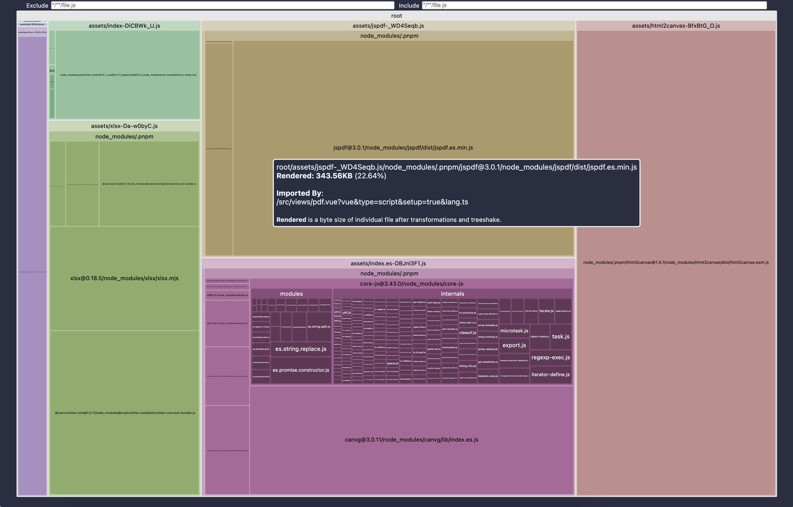
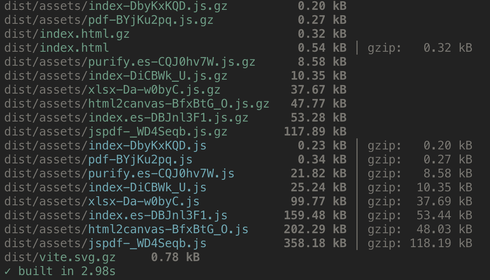

## build-optimization

### 构建产物分析

- rollup-plugin-visualizer

`rollup-plugin-visualizer`插件，是一个可视化工具，以图表的形式，展示打包结果的模块构成与体积分布。




### 分包

```typescript
// vite.config.ts
import { defineConfig } from 'vite'
import vue from '@vitejs/plugin-vue'

// https://vite.dev/config/
export default defineConfig({
  plugins: [
    vue(),
  ],
  build: {
    rollupOptions: {
      experimentalLogSideEffects: true,
      output: {
        experimentalMinChunkSize: 0,
        // experimentalMinChunkSize: 20 * 1024,
        manualChunks: (id: string) => {
          if (id.includes('html2canvas')) {
            return 'html2canvas';
          }
          if (id.includes('jspdf')) {
            return 'jspdf';
          }
          if (id.includes('xlsx')) {
            return 'xlsx';
          }
        }
      }
    }
  },
})
```



### 生产移除 console.log

- vite-plugin-remove-console

```ts
import { defineConfig } from 'vite'
import vue from '@vitejs/plugin-vue'
import removeConsole from "vite-plugin-remove-console";

// https://vite.dev/config/
export default defineConfig({
  plugins: [
    vue(),
    removeConsole(),
  ],
})
```

### 代码压缩

- vite-plugin-compression2

```ts
import { defineConfig } from 'vite'
import vue from '@vitejs/plugin-vue'
import { compression } from 'vite-plugin-compression2'

// https://vite.dev/config/
export default defineConfig({
  plugins: [
    vue(),
    compression({
      algorithms: [
        'gzip',
      ]
    })
  ],
})
```


